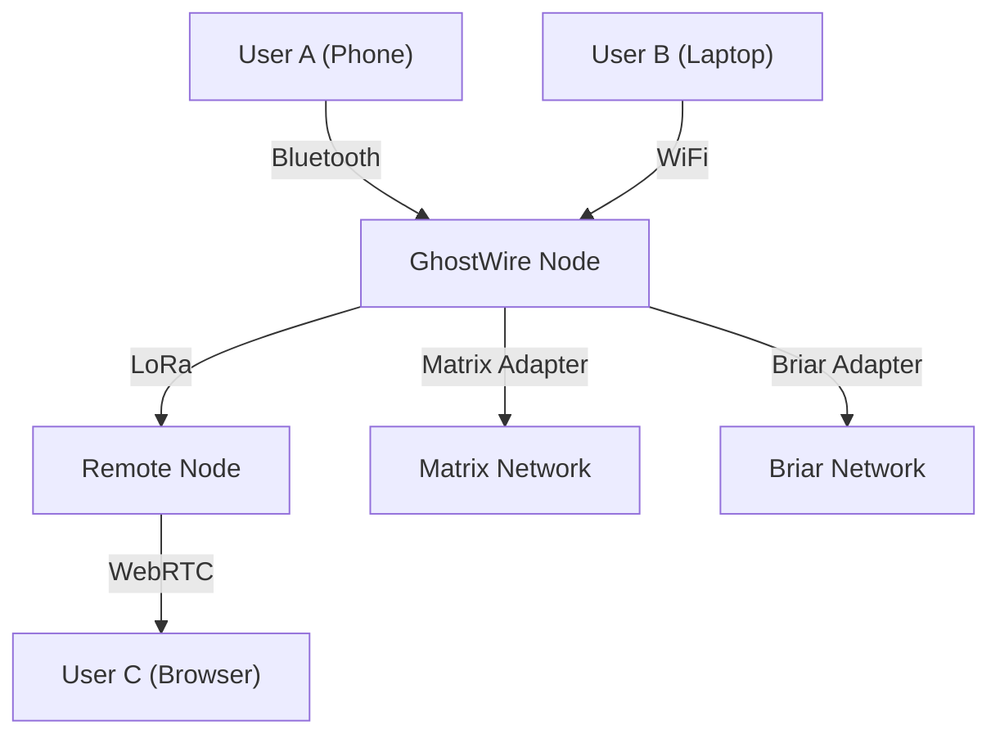

# GhostWire Project Overview

---

## Executive Summary

**GhostWire** is a modular, privacy-focused mesh networking and messaging platform designed for everyone—from activists and disaster responders to rural communities and tech enthusiasts. It enables secure, decentralized communication even when the internet is down or censored.

---

## Table of Contents
1. What is GhostWire?
2. Why Mesh Networking?
3. Real-World Scenarios
4. Key Features & Benefits
5. How GhostWire Works (Plain & Technical)
6. Visual Guide: GhostWire in Action
7. Best Practices & Anti-Patterns
8. Frequently Asked Questions
9. Further Reading & Resources

---

## 1. What is GhostWire?

GhostWire lets people connect and communicate directly, forming a mesh network using whatever technology is available: Bluetooth, WiFi, LoRa, WebRTC, or even standard internet. It bridges different protocols (like Briar, Meshtastic, Matrix) and puts privacy and security first.

- **For non-technical readers:** Think of GhostWire as a walkie-talkie for the digital age, but smarter and more private. You can send messages, share files, and connect with others—even if the internet is blocked or down.
- **For technical readers:** GhostWire is a modular, extensible platform built in Rust and TypeScript, supporting pluggable transports, protocol adapters, and advanced security modules.

---

## 2. Why Mesh Networking?

- **Resilience:** Mesh networks don’t rely on a single server or internet connection. If one device goes down, others keep the network alive.
- **Privacy:** No central authority means less risk of surveillance or censorship.
- **Flexibility:** Works with many technologies—Bluetooth, WiFi, LoRa, and more.

---

## 3. Real-World Scenarios

### Activists in Censored Regions
- **Problem:** Internet blackouts and surveillance.
- **Solution:** GhostWire forms a local mesh, letting activists communicate securely and privately.

### Disaster Response
- **Problem:** Infrastructure is down after a natural disaster.
- **Solution:** First responders use GhostWire to coordinate rescue efforts, even without cell towers.

### Rural Communities
- **Problem:** No reliable internet access.
- **Solution:** GhostWire connects villages using LoRa and WiFi, enabling messaging and information sharing.

### Community Events
- **Problem:** Overloaded networks at large gatherings.
- **Solution:** Attendees use GhostWire to share updates and stay connected.

---

## 4. Key Features & Benefits

- **Decentralized:** No single point of failure.
- **Privacy-First:** End-to-end encryption, metadata protection, and traffic obfuscation.
- **Modular:** Add or remove transports and adapters as needed.
- **Cross-Protocol:** Bridge to Briar, Meshtastic, Matrix, and more.
- **User-Friendly:** Simple web and mobile interfaces.
- **Open Source:** Transparent, auditable, and community-driven.

---

## 5. How GhostWire Works (Plain & Technical)

### Plain-Language Overview
- Devices connect directly to each other, forming a web (mesh).
- Messages hop from device to device until they reach their destination.
- No internet? No problem—use Bluetooth, WiFi, or LoRa.
- Everything is encrypted and private.

### Technical Deep Dive
- **Core:** Rust backend with modular traits for transports, adapters, and security.
- **Frontend:** React/TypeScript web UI, CLI for power users.
- **Transports:** Pluggable modules for Bluetooth, WiFi, LoRa, WebRTC, TCP/IP.
- **Adapters:** Protocol bridges for Briar, Meshtastic, Matrix, etc.
- **Security:** End-to-end encryption (AES-256-GCM, X25519), Sybil defense, quotas, blacklists, traffic obfuscation.
- **Store & Forward:** Messages are cached and relayed when possible.

---

## 6. Visual Guide: GhostWire in Action

---

## 7. Best Practices & Anti-Patterns

### Best Practices
- Use multiple transports for resilience.
- Keep software updated for latest security patches.
- Use strong, unique passwords for device access.
- Educate users about privacy and security features.

### Anti-Patterns
- Relying on a single transport (e.g., only WiFi).
- Disabling encryption or security modules.
- Ignoring software updates.

---

## 8. Frequently Asked Questions

**Q: Is GhostWire legal to use?**
A: In most countries, yes—but always check local laws, especially regarding encryption and radio use.

**Q: Can I use GhostWire without the internet?**
A: Yes! That’s one of its main features.

**Q: How secure is GhostWire?**
A: It uses state-of-the-art encryption and privacy techniques, but no system is 100% secure. Follow best practices.

**Q: Can I contribute?**
A: Absolutely! See the Contributing chapter.

---

## 9. Further Reading & Resources

- [GhostWire GitHub](https://github.com/phantomojo/GhostWire-secure-mesh-communication)
- [Mesh Networking 101](https://en.wikipedia.org/wiki/Mesh_networking)
- [Briar Project](https://briarproject.org/)
- [Meshtastic](https://meshtastic.org/)
- [Matrix Protocol](https://matrix.org/)
- [LoRa Technology](https://lora-alliance.org/about-lorawan/)

---

## Appendix: Glossary

- **Mesh Network:** A network where each device relays data for others.
- **Transport:** The method used to send messages (Bluetooth, WiFi, etc.).
- **Protocol Adapter:** Software that bridges GhostWire to other networks.
- **Node:** Any device running GhostWire.
- **Sybil Attack:** When one entity pretends to be many nodes.
- **Quota:** Limit on messages/actions to prevent abuse.

---

## End of Chapter 