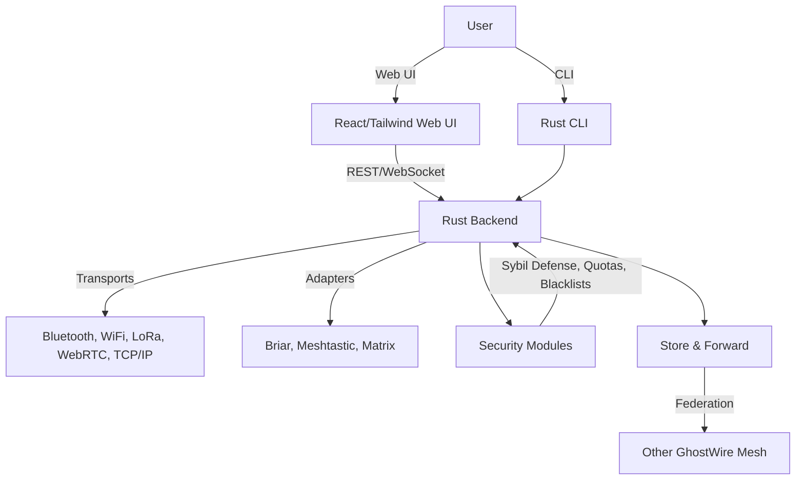

# Architecture Deep Dive

---

## Table of Contents
1. Overview & Philosophy
2. System Diagram & Visuals
3. Core Components (Plain & Technical)
4. Transports Layer
5. Protocol Adapters Layer
6. Security & Trust Layer
7. Store & Forward / Federation
8. Data Flow: Message Lifecycle
9. Deployment Blueprints
10. Best Practices & Anti-Patterns
11. Glossary & Reference

---

## 1. Overview & Philosophy

GhostWire is built for modularity, security, and real-world flexibility. The architecture is designed to:
- Support multiple transports and protocols
- Enable privacy and resilience by default
- Allow easy extension and adaptation for new use cases

---

## 2. System Diagram & Visuals



---

## 3. Core Components (Plain & Technical)

### Plain-Language
- **Web UI:** The dashboard you use in your browser.
- **CLI:** Command-line tool for advanced users.
- **Backend:** The “brain” that connects everything, runs on your device.
- **Transports:** The “roads” messages travel on (Bluetooth, WiFi, etc.).
- **Adapters:** “Translators” that let GhostWire talk to other networks.
- **Security Modules:** Keep your messages private and your network safe.
- **Store & Forward:** Lets messages wait and be delivered later if needed.

### Technical
- **Rust Backend:** Implements core traits: `Transport`, `ProtocolAdapter`, `KeyManager`, `QuotaEnforcer`, etc.
- **Frontend:** React/TypeScript, communicates via REST/WebSocket APIs.
- **Transports:** Each is a Rust module implementing the `Transport` trait, can be enabled/disabled at runtime.
- **Adapters:** Rust modules implementing `ProtocolAdapter`, handle translation, deduplication, and relay.
- **Security:** Modular, pluggable, with Sybil defense, quotas, blacklists, traffic obfuscation, and more.
- **Store & Forward:** Message cache, relay, and federation logic.

---

## 4. Transports Layer

- **Supported:** Bluetooth, WiFi, LoRa, WebRTC, TCP/IP
- **Pluggable:** Add new transports by implementing the `Transport` trait.
- **Runtime Selection:** Enable/disable transports via config or UI.
- **Visual:**
  ```mermaid
  graph LR;
    Backend --> Bluetooth
    Backend --> WiFi
    Backend --> LoRa
    Backend --> WebRTC
    Backend --> TCPIP
  ```
- **Best Practice:** Use multiple transports for resilience.

---

## 5. Protocol Adapters Layer

- **Purpose:** Bridge GhostWire to other networks (Briar, Meshtastic, Matrix, etc.)
- **How:** Implement the `ProtocolAdapter` trait.
- **Features:** Message translation, deduplication, relay, group chat, file sharing.
- **Visual:**
  ```mermaid
  graph LR;
    Backend --> BriarAdapter
    Backend --> MeshtasticAdapter
    Backend --> MatrixAdapter
    BriarAdapter --> BriarNetwork
    MeshtasticAdapter --> MeshtasticNetwork
    MatrixAdapter --> MatrixNetwork
  ```

---

## 6. Security & Trust Layer

- **Modules:**
  - SybilDefense
  - QuotaEnforcer
  - BlacklistManager
  - TrafficObfuscator
  - KeyManager
- **Features:**
  - End-to-end encryption (AES-256-GCM, X25519)
  - Perfect forward secrecy
  - Ephemeral keys, key rotation
  - Quotas and rate limiting
  - Blacklisting and abuse prevention
  - Traffic obfuscation and anti-analysis
- **Visual:**
  ```mermaid
  graph TD;
    Backend --> Security["Security Modules"]
    Security --> SybilDefense
    Security --> QuotaEnforcer
    Security --> BlacklistManager
    Security --> TrafficObfuscator
    Security --> KeyManager
  ```

---

## 7. Store & Forward / Federation

- **Store & Forward:** Messages are cached and relayed when possible.
- **Federation:** Meshes can connect to each other for wider reach.
- **Visual:**
  ```mermaid
  graph TD;
    NodeA --> Store
    Store --> NodeB
    Store --> Federation["Other Mesh"]
  ```

---

## 8. Data Flow: Message Lifecycle

1. **User sends message via UI/CLI**
2. **Backend encrypts and signs message**
3. **Message routed via best available transport(s)**
4. **Adapters translate if needed**
5. **Security modules enforce quotas, check blacklists**
6. **Message hops node-to-node (store & forward as needed)**
7. **Recipient decrypts and reads message**

---

## 9. Deployment Blueprints

### Home/Personal Mesh
- Single device or small group, WiFi/Bluetooth
- Simple setup, auto-discovery

### Community/Neighborhood Mesh
- Dozens of nodes, mix of WiFi, LoRa, Bluetooth
- Some nodes act as relays
- Store & forward for offline delivery

### Disaster/Field Deployment
- LoRa nodes at key locations
- Battery/solar-powered relays
- Store & forward, federation with other meshes

### Enterprise/Federated Mesh
- Multiple sites, federation, quotas, advanced security
- Integration with existing systems via adapters

---

## 10. Best Practices & Anti-Patterns

### Best Practices
- Use multiple transports for resilience
- Enable all relevant security modules
- Regularly update software
- Monitor mesh health and logs
- Educate users on privacy and security

### Anti-Patterns
- Relying on a single transport
- Disabling security features
- Ignoring updates or logs

---

## 11. Glossary & Reference

- **Node:** Any device running GhostWire
- **Transport:** Bluetooth, WiFi, LoRa, etc.
- **Adapter:** Bridge to other protocols
- **Sybil Attack:** One entity pretends to be many nodes
- **Quota:** Limit on messages/actions
- **Federation:** Connecting multiple meshes

---

## End of Chapter 