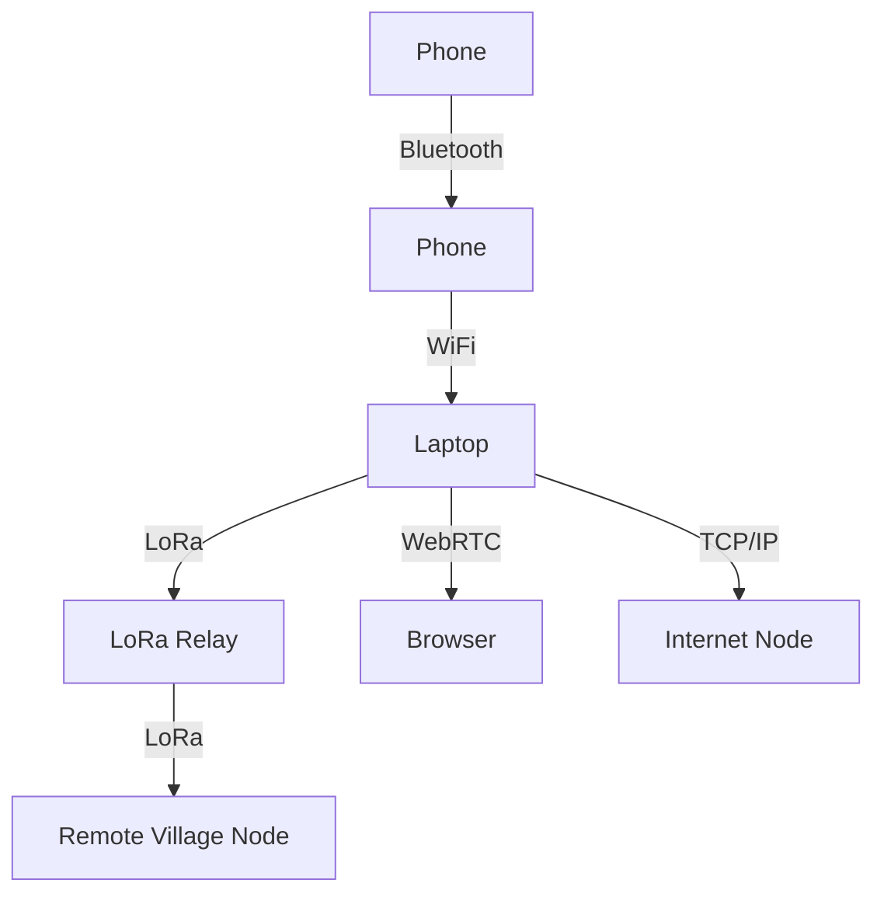

# Transports & Protocols

---

## Table of Contents
1. What is a Transport?
2. Supported & Planned Transports
3. How Transports Work (Plain & Technical)
4. Real-World Use Cases
5. Configuration & Code Examples
6. Visual Guide: Transport Topologies
7. Best Practices & Anti-Patterns
8. Troubleshooting & FAQ
9. Further Reading & Resources

---

## 1. What is a Transport?

- **Plain:** A transport is the “road” your messages travel on—Bluetooth, WiFi, LoRa, WebRTC, TCP/IP, and more.
- **Technical:** In GhostWire, each transport is a pluggable module implementing the `Transport` trait, allowing for runtime or compile-time enable/disable.

---

## 2. Supported & Planned Transports

| Transport   | Status    | Use Case / Notes                                  |
|-------------|-----------|--------------------------------------------------|
| Bluetooth   | Planned   | Short-range, mobile-to-mobile, disaster recovery  |
| WiFi        | Planned   | Local mesh, high bandwidth, urban/rural           |
| LoRa        | Planned   | Long-range, low-power, rural, disaster, off-grid  |
| WebRTC      | Planned   | Browser-to-browser, NAT traversal, stealth        |
| TCP/IP      | Supported | Standard internet, fallback, federation           |
| Stealth TCP | Planned   | Censorship resistance, obfuscation                |

---

## 3. How Transports Work (Plain & Technical)

### Plain-Language
- Devices use whatever “roads” are available to connect—Bluetooth for short range, WiFi for local, LoRa for long distance.
- GhostWire automatically picks the best available transport, or you can choose manually.

### Technical
- Each transport implements the `Transport` trait in Rust:
  ```rust
  pub trait Transport {
      fn send(&self, msg: Message) -> Result<(), TransportError>;
      fn receive(&self) -> Option<Message>;
      fn is_available(&self) -> bool;
      // ...
  }
  ```
- Transports can be enabled/disabled at runtime via config or UI.
- Multiple transports can be active at once for resilience.

---

## 4. Real-World Use Cases

### Disaster Response
- **Scenario:** Power and cell towers are down after a hurricane.
- **Solution:** LoRa nodes relay messages across miles; WiFi and Bluetooth fill in gaps.

### Urban Mesh
- **Scenario:** Protesters need secure, local communication.
- **Solution:** Phones use Bluetooth and WiFi to form a dense, resilient mesh.

### Rural Connectivity
- **Scenario:** Villages with no internet need to share news.
- **Solution:** LoRa radios connect homes and farms over long distances.

### Stealth/Censorship Resistance
- **Scenario:** Authorities block internet and monitor traffic.
- **Solution:** Stealth TCP and WebRTC provide obfuscated, hard-to-block channels.

---

## 5. Configuration & Code Examples

### Enabling/Disabling Transports (Config)
```toml
[transports]
bluetooth = true
wifi = true
lora = false
webrtc = true
tcpip = true
stealth_tcp = false
```

### Using Transports in Code
```rust
let wifi = WifiTransport::new();
let lora = LoRaTransport::new();
backend.add_transport(Box::new(wifi));
backend.add_transport(Box::new(lora));
```

### Web UI Example
- Go to Settings > Transports
- Toggle available transports on/off
- See real-time status and diagnostics

---

## 6. Visual Guide: Transport Topologies



---

## 7. Best Practices & Anti-Patterns

### Best Practices
- Enable multiple transports for best coverage.
- Test transport availability before deployment.
- Use LoRa for long-range, low-power needs.
- Use WebRTC/Stealth TCP for censorship resistance.
- Monitor transport health in the UI.

### Anti-Patterns
- Relying on a single transport.
- Disabling security features on transports.
- Ignoring hardware compatibility.

---

## 8. Troubleshooting & FAQ

| Problem                        | Solution                                      |
|-------------------------------|-----------------------------------------------|
| Can’t connect via Bluetooth    | Check permissions, try WiFi or LoRa           |
| LoRa not working               | Check hardware, drivers, and range            |
| WebRTC fails                   | Check firewall/NAT, try TCP/IP fallback       |
| Slow performance               | Use higher-bandwidth transport if possible    |
| Security warning               | Ensure encryption is enabled on all transports|

---

## 9. Further Reading & Resources
- [LoRa Alliance](https://lora-alliance.org/)
- [Bluetooth Mesh](https://www.bluetooth.com/learn-about-bluetooth/bluetooth-technology/bluetooth-mesh-networking/)
- [WebRTC](https://webrtc.org/)
- [Mesh Networking 101](https://en.wikipedia.org/wiki/Mesh_networking)
- [GhostWire Developer Guide](12_developer_guide.pdf)

---

## End of Chapter 