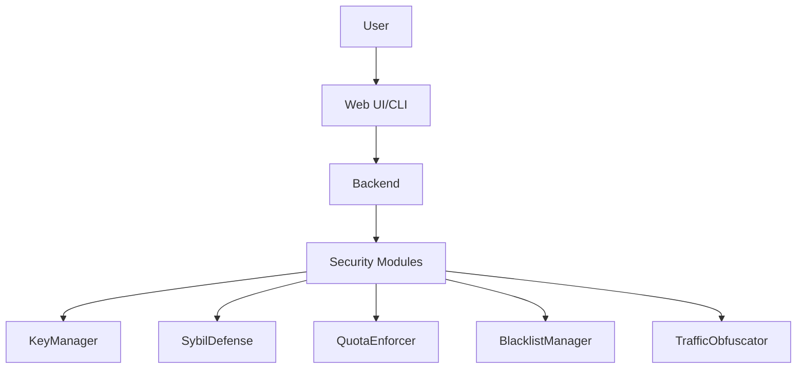

# Security & Privacy

---

## Table of Contents
1. Executive Summary
2. Security Foundations (Plain & Technical)
3. Threat Models & Real-World Risks
4. Security Architecture & Modules
5. Encryption & Key Management
6. Sybil Defense & Trust
7. Quotas, Blacklists, and Abuse Prevention
8. Traffic Obfuscation & Anti-Analysis
9. Disaster & Censorship Scenarios
10. Best Practices & Anti-Patterns
11. Actionable Security Checklists
12. Visuals: Security Layers & Flows
13. FAQ & Troubleshooting
14. Further Reading & Resources

---

## 1. Executive Summary

GhostWire is built with security and privacy as core principles. This chapter explains how GhostWire protects users, what threats it defends against, and how to use its security features—whether you’re a non-technical user or a security engineer.

---

## 2. Security Foundations (Plain & Technical)
- **Plain:** GhostWire keeps your messages private and your identity safe, even if someone tries to spy or block you.
- **Technical:** End-to-end encryption (AES-256-GCM, X25519), perfect forward secrecy, ephemeral keys, key rotation, secure storage, and post-quantum crypto (planned).

---

## 3. Threat Models & Real-World Risks
- **Censorship:** Governments or ISPs blocking or monitoring traffic.
- **Surveillance:** Adversaries trying to read or analyze messages.
- **Sybil Attacks:** Fake nodes trying to disrupt or spy on the mesh.
- **Denial of Service:** Flooding the network to disrupt communication.
- **Traffic Analysis:** Inferring who is talking to whom, even if messages are encrypted.
- **Device Seizure:** Physical access to a device running GhostWire.

---

## 4. Security Architecture & Modules
- **SybilDefense:** Prevents fake nodes from overwhelming the mesh.
- **QuotaEnforcer:** Limits message rates to prevent spam/DoS.
- **BlacklistManager:** Blocks known abusers or compromised nodes.
- **TrafficObfuscator:** Makes traffic patterns harder to analyze.
- **KeyManager:** Handles encryption keys, rotation, and secure storage.

---

## 5. Encryption & Key Management
- **End-to-end encryption:** All messages are encrypted from sender to recipient.
- **Key exchange:** X25519 for secure, ephemeral key exchange.
- **Key rotation:** Regularly rotates keys for forward secrecy.
- **Secure storage:** Keys are stored encrypted on disk.
- **Post-quantum:** Research and planning for future upgrades.

---

## 6. Sybil Defense & Trust
- **Proof-of-Work/Stake:** Optional modules to make Sybil attacks expensive.
- **Reputation:** Nodes can build trust over time.
- **Manual approval:** Option for closed/curated meshes.

---

## 7. Quotas, Blacklists, and Abuse Prevention
- **Quotas:** Rate limits on messages, connections, and actions.
- **Blacklists:** Block known abusers or compromised nodes.
- **Automated & manual controls:** Admins can adjust settings in real time.

---

## 8. Traffic Obfuscation & Anti-Analysis
- **Padding:** Adds random data to messages to hide true size.
- **Timing obfuscation:** Randomizes message timing to prevent correlation.
- **Stealth transports:** Use WebRTC, Stealth TCP, or other obfuscated channels.

---

## 9. Disaster & Censorship Scenarios
- **Disaster mode:** Store-and-forward, minimal metadata, offline queuing.
- **Censorship resistance:** Stealth transports, traffic obfuscation, rapid key rotation.

---

## 10. Best Practices & Anti-Patterns
### Best Practices
- Always use the latest version.
- Enable all security modules.
- Use strong passwords and device security.
- Educate users about privacy features.
### Anti-Patterns
- Disabling encryption or security modules.
- Using default passwords.
- Ignoring updates or logs.

---

## 11. Actionable Security Checklists
- [ ] Update software regularly
- [ ] Enable all security modules
- [ ] Use strong, unique passwords
- [ ] Monitor mesh health and logs
- [ ] Educate users on privacy and security

---

## 12. Visuals: Security Layers & Flows

---

## 13. FAQ & Troubleshooting
- **Q: How do I know my messages are secure?**
  - All messages are end-to-end encrypted by default.
- **Q: What if my device is seized?**
  - Keys are encrypted on disk; use device encryption for extra safety.
- **Q: Can I disable security features?**
  - Not recommended; only for advanced users in test environments.

---

## 14. Further Reading & Resources
- [EFF Surveillance Self-Defense](https://ssd.eff.org/)
- [OWASP Top 10](https://owasp.org/www-project-top-ten/)
- [GhostWire Advanced Security](10_advanced_security.pdf)

---

## End of Chapter 