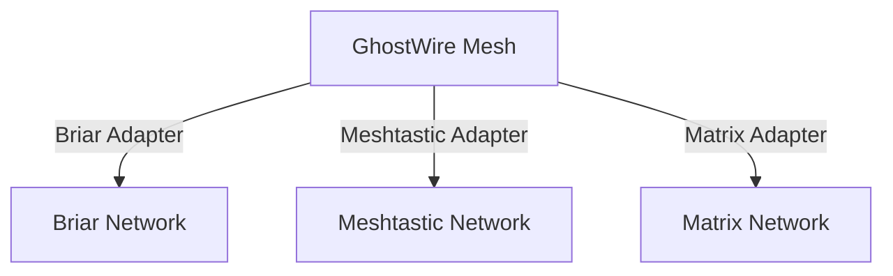

# Protocol Adapters

---

## Table of Contents
1. What is a Protocol Adapter?
2. Supported & Planned Adapters
3. How Adapters Work (Plain & Technical)
4. Real-World Bridging Scenarios
5. Configuration & Code Examples
6. Visual Guide: Adapter Topologies
7. Developer Notes & API Reference
8. Best Practices & Anti-Patterns
9. Troubleshooting & FAQ
10. Further Reading & Resources

---

## 1. What is a Protocol Adapter?

- **Plain:** A protocol adapter is like a translator that lets GhostWire talk to other messaging networks (like Briar, Meshtastic, Matrix).
- **Technical:** Adapters are software modules that translate messages and events between GhostWire and other protocols, enabling cross-network messaging, group chat, and file sharing.

---

## 2. Supported & Planned Adapters

| Adapter     | Status    | Notes / Features                                 |
|-------------|-----------|--------------------------------------------------|
| Briar       | Planned   | Contact-based messaging, offline queuing, groups  |
| Meshtastic  | Planned   | LoRa radio, store-and-forward, mesh bridging      |
| Matrix      | Planned   | Federated chat, rooms, bridges to other networks  |
| Custom      | Supported | Build your own adapter for any protocol           |

---

## 3. How Adapters Work (Plain & Technical)

### Plain-Language
- Adapters “translate” messages so GhostWire can talk to other networks.
- You can bridge a GhostWire mesh to Briar, Meshtastic, or Matrix, sharing messages and files.

### Technical
- Each adapter implements the `ProtocolAdapter` trait in Rust:
  ```rust
  pub trait ProtocolAdapter {
      fn send(&self, msg: Message) -> Result<(), AdapterError>;
      fn receive(&self) -> Option<Message>;
      fn connect(&self) -> Result<(), AdapterError>;
      // ...
  }
  ```
- Adapters handle translation, deduplication, relay, and group management.

---

## 4. Real-World Bridging Scenarios

### Disaster Response
- **Scenario:** GhostWire mesh bridges to Meshtastic LoRa radios for long-range communication.
- **Outcome:** First responders can relay messages between phone users and LoRa devices.

### Activist Network
- **Scenario:** Protesters use GhostWire to bridge to Matrix for global reach.
- **Outcome:** Local mesh messages are relayed to Matrix rooms, connecting to the outside world.

### Rural Community
- **Scenario:** GhostWire connects to Briar for secure, contact-based messaging.
- **Outcome:** Villagers can chat securely, even offline.

---

## 5. Configuration & Code Examples

### Enabling/Disabling Adapters (Config)
```toml
[adapters]
briar = true
meshtastic = true
matrix = false
custom = true
```

### Using Adapters in Code
```rust
let briar = BriarAdapter::new();
let matrix = MatrixAdapter::new();
backend.add_adapter(Box::new(briar));
backend.add_adapter(Box::new(matrix));
```

### Web UI Example
- Go to Settings > Adapters
- Toggle available adapters on/off
- See real-time status and diagnostics

---

## 6. Visual Guide: Adapter Topologies



---

## 7. Developer Notes & API Reference
- **Implementing a new adapter:**
  - Implement the `ProtocolAdapter` trait.
  - Handle message translation, deduplication, and relay.
  - Register the adapter in the backend.
- **API Reference:**
  - See Developer Guide for full trait and API docs.

---

## 8. Best Practices & Anti-Patterns
### Best Practices
- Test adapters in isolated environments before production.
- Keep adapters updated for protocol changes.
- Monitor adapter health and logs.
### Anti-Patterns
- Relying on a single adapter for all bridging.
- Disabling security features on adapters.
- Ignoring protocol updates.

---

## 9. Troubleshooting & FAQ
| Problem                        | Solution                                      |
|-------------------------------|-----------------------------------------------|
| Can’t connect to Matrix        | Check credentials, server URL, and network    |
| Briar messages not relayed     | Check adapter status and logs                 |
| Meshtastic bridge fails        | Check LoRa hardware and adapter config        |
| Duplicate messages             | Ensure deduplication is enabled               |

---

## 10. Further Reading & Resources
- [Matrix Protocol](https://matrix.org/)
- [Briar Project](https://briarproject.org/)
- [Meshtastic](https://meshtastic.org/)
- [GhostWire Developer Guide](12_developer_guide.pdf)

---

## End of Chapter 