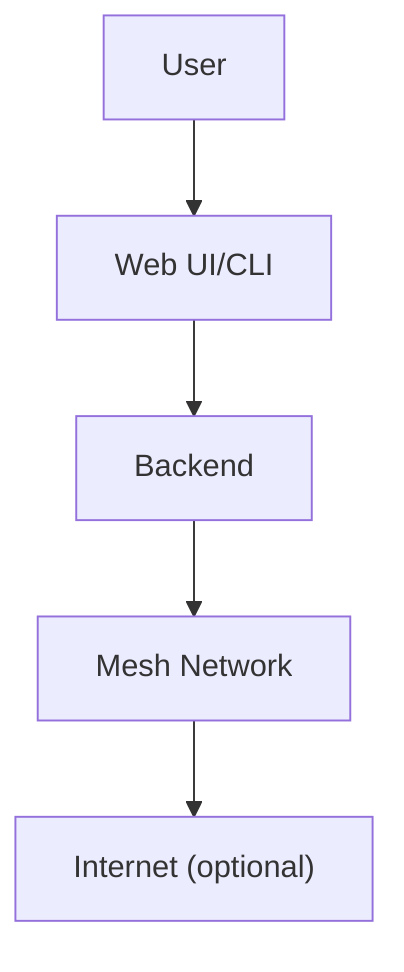

# Frequently Asked Questions (FAQ)

---

## Table of Contents
1. General Questions
2. Getting Started
3. Technical & Developer Questions
4. Security & Privacy
5. Real-World Scenarios
6. Troubleshooting & Support
7. Visuals: Common Flows
8. Further Reading & Resources

---

## 1. General Questions

**Q: What is GhostWire?**
A: A modular, privacy-focused mesh networking and messaging platform supporting multiple transports and advanced security.

**Q: Who can use GhostWire?**
A: Anyone! It’s designed for activists, disaster responders, rural communities, privacy enthusiasts, and developers.

**Q: Is GhostWire free and open-source?**
A: Yes! The code is on [GitHub](https://github.com/phantomojo/GhostWire-secure-mesh-communication).

**Q: What platforms are supported?**
A: Linux, Windows, macOS, and (soon) mobile platforms.

---

## 2. Getting Started

**Q: How do I install and run GhostWire?**
A: See the Getting Started chapter. You’ll need Rust, Node.js, and npm for the full stack, or you can try the web demo (if available).

**Q: Do I need to be a developer?**
A: No! There are easy-to-use web and mobile interfaces.

**Q: Can I join a mesh without the internet?**
A: Yes! Use Bluetooth, WiFi, or LoRa to connect locally.

---

## 3. Technical & Developer Questions

**Q: How do I add a new transport or adapter?**
A: See the Developer Guide. Implement the relevant trait (`Transport` or `ProtocolAdapter`) and register it in the backend.

**Q: Is there a plugin system?**
A: Yes! GhostWire is designed for modularity and extension.

**Q: How do I contribute code?**
A: Fork the repo, make your changes, and submit a pull request. See the Contributing chapter for details.

---

## 4. Security & Privacy

**Q: How secure is GhostWire?**
A: All messages are end-to-end encrypted. See the Security chapter for details.

**Q: What if my device is seized?**
A: Keys are encrypted on disk. Use device encryption for extra safety.

**Q: Can I disable security features?**
A: Not recommended; only for advanced users in test environments.

---

## 5. Real-World Scenarios

**Q: How does GhostWire help in a disaster?**
A: Enables communication when infrastructure is down, using LoRa, WiFi, and Bluetooth.

**Q: Can GhostWire bypass censorship?**
A: Yes! Stealth transports and traffic obfuscation help evade blocks.

**Q: Has GhostWire been used in real-world events?**
A: See the Case Studies chapter for detailed stories.

---

## 6. Troubleshooting & Support

| Problem                        | Solution                                      |
|-------------------------------|-----------------------------------------------|
| Can’t find other nodes         | Check transport settings, try another method  |
| Messages not sending           | Ensure at least one transport is active       |
| Web UI won’t load              | Check backend is running, try npm install     |
| LoRa not working               | Check hardware, drivers, and permissions      |
| Security warning               | Ensure you’re using the latest version        |

- **Logs:** Check backend logs for errors.
- **Community:** Ask for help on GitHub or project chat.

---

## 7. Visuals: Common Flows

---

## 8. Further Reading & Resources
- [GhostWire GitHub](https://github.com/phantomojo/GhostWire-secure-mesh-communication)
- [Mesh Networking 101](https://en.wikipedia.org/wiki/Mesh_networking)
- [Security & Privacy](05_security.pdf)
- [Developer Guide](12_developer_guide.pdf)

---

## End of Chapter 