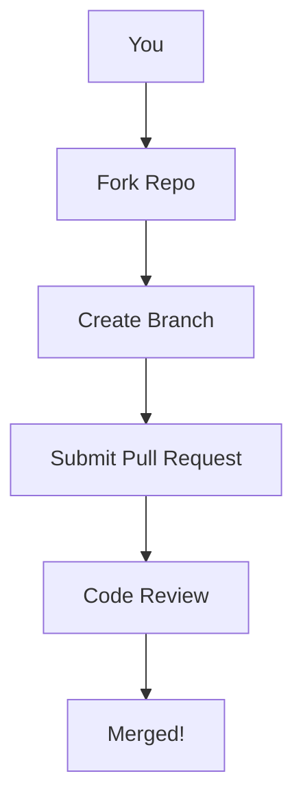

# Contributing & Community

---

## Table of Contents
1. Welcome & Philosophy
2. How Anyone Can Contribute
3. Code Contributions (Technical)
4. Writing, Design, and Outreach
5. Community Guidelines & Code of Conduct
6. First Contribution Stories
7. Visuals: Contribution Flow
8. Best Practices for Contributors
9. Further Reading & Resources

---

## 1. Welcome & Philosophy

GhostWire is open to everyone—whether you’re a coder, writer, designer, tester, or just curious. Here’s how you can help build the future of secure, decentralized communication.

---

## 2. How Anyone Can Contribute
- **Test the app:** Try GhostWire and give feedback.
- **Report bugs:** Found a problem? Open an issue on GitHub.
- **Write docs:** Help make guides clearer for everyone.
- **Design:** Improve the UI/UX or create graphics.
- **Spread the word:** Share GhostWire with your community.
- **Join discussions:** Help shape the roadmap and features.

---

## 3. Code Contributions (Technical)
- **Code style:**
  - Rust: Follow rustfmt and clippy guidelines.
  - JS/TS: Use Prettier and ESLint.
- **How to contribute:**
  1. Fork the repo on GitHub.
  2. Create a feature branch.
  3. Make your changes and add tests.
  4. Run all tests and linters.
  5. Submit a pull request with a clear description.
- **Review process:**
  - All PRs are reviewed for security, style, and clarity.
  - Feedback is constructive and focused on improvement.

---

## 4. Writing, Design, and Outreach
- **Docs:** Improve guides, add visuals, translate content.
- **Design:** Create logos, UI mockups, infographics.
- **Outreach:** Write blog posts, give talks, organize events.

---

## 5. Community Guidelines & Code of Conduct
- **Be respectful:** Treat everyone with kindness and respect.
- **Be inclusive:** Welcome contributors of all backgrounds and skill levels.
- **No harassment:** Zero tolerance for abuse or discrimination.
- **Help others:** Support newcomers and share knowledge.

---

## 6. First Contribution Stories
- **Story 1:** “I fixed a typo in the docs and learned how to use GitHub!”
- **Story 2:** “I added a new transport and saw my code help real users.”
- **Story 3:** “I designed a new logo and it’s now on the project site.”

---

## 7. Visuals: Contribution Flow

---

## 8. Best Practices for Contributors
- Communicate clearly and kindly.
- Ask questions if you’re unsure.
- Test your changes before submitting.
- Review the documentation and guidelines.
- Celebrate your contributions!

---

## 9. Further Reading & Resources
- [GhostWire GitHub](https://github.com/phantomojo/GhostWire-secure-mesh-communication)
- [CONTRIBUTING.md](../CONTRIBUTING.md)
- [Code of Conduct](../ghostwire/CODE_OF_CONDUCT.md)
- [Open Source Guides](https://opensource.guide/)

---

## End of Chapter 