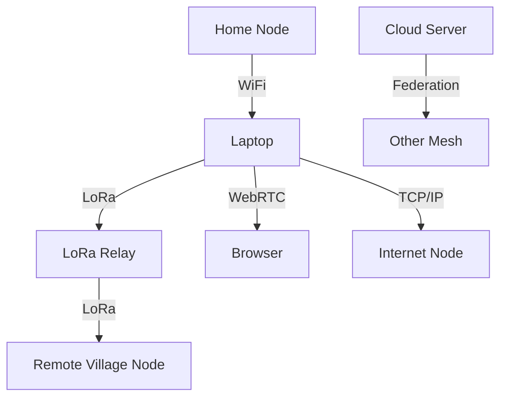

# Deployment & Operations

---

## Table of Contents
1. Overview
2. Deployment Scenarios
3. Step-by-Step Deployment Guides
4. Docker, Cloud, and Bare-Metal Installations
5. Monitoring, Logging, and Maintenance
6. Visuals: Deployment Topologies
7. Troubleshooting & Recovery
8. Best Practices & Anti-Patterns
9. Further Reading & Resources

---

## 1. Overview

This chapter covers how to deploy, operate, and maintain GhostWire in a variety of real-world scenarios—from a single home node to a city-wide mesh. Both non-technical and technical readers will find step-by-step guides, visuals, and best practices.

---

## 2. Deployment Scenarios

### Home/Personal Mesh
- **Goal:** Connect a few devices (phones, laptops) for secure messaging at home or in a small group.
- **Steps:**
  1. Download and install the GhostWire app or desktop client.
  2. Start the app and select your preferred transport (Bluetooth, WiFi).
  3. Invite nearby devices to join your mesh.

### Community/Neighborhood Mesh
- **Goal:** Connect dozens of devices across a neighborhood or event.
- **Steps:**
  1. Deploy GhostWire on laptops, phones, and LoRa relays.
  2. Use WiFi and LoRa for coverage.
  3. Assign some nodes as relays for better reach.

### Disaster/Field Deployment
- **Goal:** Restore communication after infrastructure failure.
- **Steps:**
  1. Deploy LoRa nodes at key locations (battery/solar powered).
  2. Use store-and-forward for offline delivery.
  3. Federate with other meshes if possible.

### Enterprise/Federated Mesh
- **Goal:** Connect multiple sites, enable advanced security, and integrate with existing systems.
- **Steps:**
  1. Deploy GhostWire on servers (bare-metal or cloud).
  2. Use Docker or Kubernetes for scaling.
  3. Integrate with protocol adapters for interoperability.

---

## 3. Step-by-Step Deployment Guides

### Local (Laptop/Desktop)
1. Download and install GhostWire.
2. Run the backend and web UI.
3. Join or create a mesh.

### Docker
1. Pull the GhostWire Docker image:
   ```sh
   docker pull phantomojo/ghostwire:latest
   ```
2. Run the container:
   ```sh
   docker run -d -p 3000:3000 -p 9000:9000 phantomojo/ghostwire:latest
   ```
3. Access the web UI at [http://localhost:3000](http://localhost:3000)

### Cloud (AWS, GCP, Azure)
1. Provision a VM or container instance.
2. Install Docker or run natively.
3. Open required ports (3000, 9000, LoRa if needed).
4. Secure with firewalls and access controls.

### Bare-Metal
1. Install Rust and Node.js.
2. Build and run GhostWire as per Getting Started.
3. Set up systemd service for auto-restart.

---

## 4. Docker, Cloud, and Bare-Metal Installations
- **Docker:** Easiest for quick deployment and scaling.
- **Cloud:** Use for global reach, federation, and integration.
- **Bare-Metal:** Best for custom hardware, edge, or offline use.

---

## 5. Monitoring, Logging, and Maintenance
- **Monitoring:**
  - Use built-in web UI dashboard for node status and health.
  - Integrate with Prometheus/Grafana for advanced metrics.
- **Logging:**
  - Backend logs to file and stdout.
  - Use log rotation for long-term deployments.
- **Maintenance:**
  - Regularly update software.
  - Backup configuration and keys.
  - Test failover and recovery procedures.

---

## 6. Visuals: Deployment Topologies


---

## 7. Troubleshooting & Recovery
| Problem                        | Solution                                      |
|-------------------------------|-----------------------------------------------|
| Node won’t start               | Check logs, ensure dependencies are installed  |
| Can’t connect to mesh          | Check transport settings, firewall, and ports  |
| Docker container fails         | Check image version, logs, and port mapping    |
| Cloud instance unreachable     | Check security groups, firewall, and DNS       |
| LoRa not working               | Check hardware, drivers, and permissions       |

---

## 8. Best Practices & Anti-Patterns
### Best Practices
- Use Docker for easy scaling and updates.
- Monitor node health and logs.
- Regularly backup configuration and keys.
- Test failover and recovery.
- Secure cloud deployments with firewalls and access controls.
### Anti-Patterns
- Ignoring updates or logs.
- Using default passwords or open ports.
- Not testing disaster recovery.

---

## 9. Further Reading & Resources
- [Docker Documentation](https://docs.docker.com/)
- [Prometheus](https://prometheus.io/)
- [Grafana](https://grafana.com/)
- [GhostWire Developer Guide](12_developer_guide.pdf)

---

## End of Chapter 