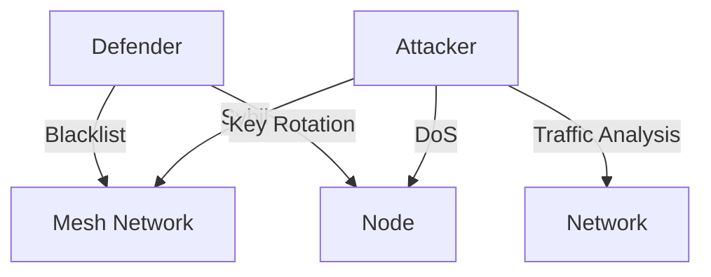

# Advanced Security & Threat Response

---

## Table of Contents
1. Overview
2. Threat Modeling (Plain & Technical)
3. Incident Response & Forensics
4. Security Module Configuration
5. Audit & Compliance
6. Example Attack/Defense Scenarios
7. Visuals: Threat Flows & Response
8. Actionable Checklists
9. Further Reading & Resources

---

## 1. Overview

This chapter is for those who want to go beyond the basics—security engineers, admins, and anyone responsible for defending a GhostWire mesh. It covers advanced threat modeling, incident response, forensics, and real-world attack/defense scenarios, with both plain-language and technical explanations.

---

## 2. Threat Modeling (Plain & Technical)
- **Plain:** Threat modeling is thinking ahead about what could go wrong and how to stop it.
- **Technical:** Use frameworks like STRIDE (Spoofing, Tampering, Repudiation, Information Disclosure, Denial of Service, Elevation of Privilege) to analyze risks.
- **Visual:**
  ```mermaid
  graph TD;
    Attacker -->|Spoofing| Node
    Attacker -->|Tampering| Message
    Attacker -->|DoS| Mesh
    Attacker -->|Traffic Analysis| Network
  ```

---

## 3. Incident Response & Forensics
- **Preparation:**
  - Document your mesh topology and key nodes.
  - Regularly backup configuration and keys.
- **Detection:**
  - Monitor logs and alerts for suspicious activity.
  - Use anomaly detection tools if available.
- **Response:**
  - Isolate compromised nodes.
  - Rotate keys and update blacklists.
  - Communicate securely with trusted nodes.
- **Forensics:**
  - Collect logs and evidence.
  - Analyze attack vectors and entry points.
  - Report findings to the community.

---

## 4. Security Module Configuration
- **SybilDefense:** Adjust proof-of-work/stake parameters.
- **QuotaEnforcer:** Set rate limits for messages and actions.
- **BlacklistManager:** Add/remove nodes as needed.
- **TrafficObfuscator:** Enable/disable padding and timing obfuscation.
- **KeyManager:** Schedule key rotation and backups.

---

## 5. Audit & Compliance
- **Audit:**
  - Regularly review logs and configuration.
  - Use automated tools for compliance checks.
- **Compliance:**
  - Follow local laws and regulations for encryption and radio use.
  - Document security policies and procedures.

---

## 6. Example Attack/Defense Scenarios
- **Sybil Attack:**
  - **Attack:** Adversary floods mesh with fake nodes.
  - **Defense:** Enable SybilDefense, require proof-of-work/stake, monitor for anomalies.
- **DoS Attack:**
  - **Attack:** Flood of messages to overwhelm nodes.
  - **Defense:** Set quotas, enable rate limiting, blacklist offenders.
- **Traffic Analysis:**
  - **Attack:** Adversary infers communication patterns.
  - **Defense:** Enable traffic obfuscation, use stealth transports.
- **Key Compromise:**
  - **Attack:** Device is seized, keys are stolen.
  - **Defense:** Use encrypted storage, rotate keys, wipe device if needed.

---

## 7. Visuals: Threat Flows & Response


---

## 8. Actionable Checklists
- [ ] Document mesh topology and key nodes
- [ ] Regularly backup configuration and keys
- [ ] Monitor logs and alerts
- [ ] Enable all security modules
- [ ] Review and update blacklists
- [ ] Test incident response procedures

---

## 9. Further Reading & Resources
- [OWASP Incident Response](https://owasp.org/www-community/Incident_Response)
- [NIST Cybersecurity Framework](https://www.nist.gov/cyberframework)
- [GhostWire Security & Privacy](05_security.pdf)

---

## End of Chapter 