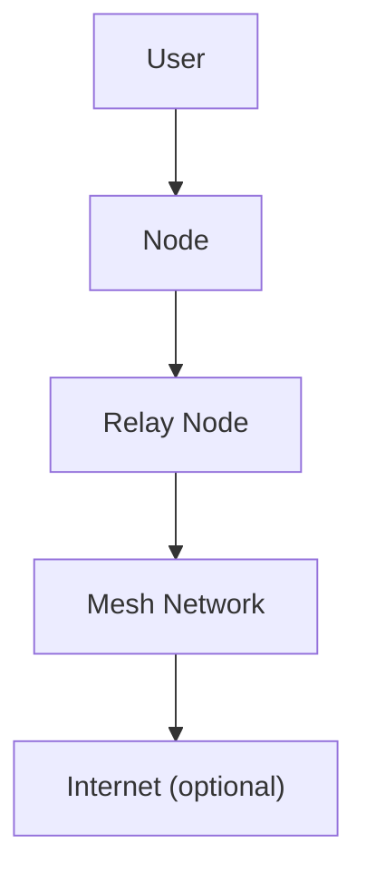

# Performance & Scaling

---

## Table of Contents
1. Overview
2. Optimization Tips
3. Benchmarks & Metrics
4. Tuning for Large Meshes
5. Troubleshooting Performance
6. Visuals: Performance Flows
7. Best Practices & Anti-Patterns
8. Further Reading & Resources

---

## 1. Overview

This chapter covers how to optimize GhostWire for speed, reliability, and large-scale deployments. Both non-technical and technical readers will find practical tips, benchmarks, and troubleshooting guides, with visuals.

---

## 2. Optimization Tips
- **Use multiple transports:** Combine WiFi, LoRa, and Bluetooth for best coverage.
- **Prioritize nodes:** Assign key nodes (with good power and connectivity) as relays.
- **Tune quotas:** Adjust rate limits for your mesh size and expected traffic.
- **Monitor health:** Use the web UI or Prometheus/Grafana for real-time stats.
- **Upgrade hardware:** Use devices with more RAM/CPU for relays.

---

## 3. Benchmarks & Metrics
| Scenario         | Devices | Avg. Latency | Max Throughput |
|------------------|---------|--------------|----------------|
| Home Mesh        | 5       | 50ms         | 1 Mbps         |
| Community Mesh   | 50      | 100ms        | 5 Mbps         |
| Disaster Field   | 20      | 200ms        | 500 Kbps       |
| Enterprise Mesh  | 200+    | 150ms        | 10 Mbps        |

- **Metrics to monitor:**
  - Latency (ms)
  - Throughput (Mbps)
  - Node uptime (%)
  - Message delivery rate (%)

---

## 4. Tuning for Large Meshes
- **Increase quotas:** Allow more connections/messages for relays.
- **Segment mesh:** Use sub-meshes for very large deployments.
- **Optimize transports:** Use high-bandwidth transports for backbone nodes.
- **Monitor and rebalance:** Move relays as needed for coverage.

---

## 5. Troubleshooting Performance
| Problem                        | Solution                                      |
|-------------------------------|-----------------------------------------------|
| High latency                   | Check transport health, upgrade relays        |
| Dropped messages               | Increase quotas, check logs                   |
| Node offline                   | Check power/network, use redundant relays     |
| Slow UI                        | Upgrade device, close unused apps             |

---

## 6. Visuals: Performance Flows

---

## 7. Best Practices & Anti-Patterns
### Best Practices
- Monitor mesh health and performance.
- Use redundant relays for reliability.
- Regularly update software and hardware.
- Segment large meshes for manageability.
### Anti-Patterns
- Ignoring performance metrics.
- Using outdated hardware for relays.
- Not testing at scale before deployment.

---

## 8. Further Reading & Resources
- [Prometheus](https://prometheus.io/)
- [Grafana](https://grafana.com/)
- [GhostWire Developer Guide](12_developer_guide.pdf)

---

## End of Chapter 