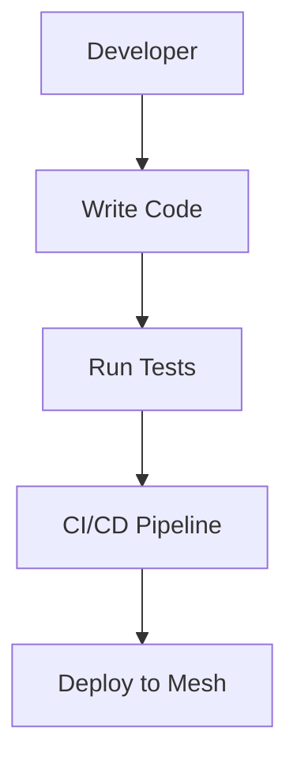

# Developer Guide

---

## Table of Contents
1. Overview
2. Extending GhostWire (Transports, Adapters, Modules)
3. API Reference & Hooks
4. Plugin System & Architecture
5. Testing & CI/CD
6. Visuals: Developer Flows
7. Best Practices & Anti-Patterns
8. Further Reading & Resources

---

## 1. Overview

This chapter is for developers who want to extend GhostWire—add new transports, adapters, modules, or contribute to the core. Both non-technical and technical readers will find step-by-step guides, API references, and best practices, with visuals.

---

## 2. Extending GhostWire (Transports, Adapters, Modules)

### Adding a New Transport
1. Implement the `Transport` trait in Rust.
2. Register your transport in the backend.
3. Add configuration options to the web UI/CLI.
4. Test with simulated and real devices.

### Adding a Protocol Adapter
1. Implement the `ProtocolAdapter` trait.
2. Handle message translation, deduplication, and relay.
3. Register the adapter in the backend.

### Adding a Security Module
1. Implement the relevant trait (e.g., `QuotaEnforcer`).
2. Register and configure in the backend.

---

## 3. API Reference & Hooks
- **REST API:**
  - `/api/nodes` – List nodes
  - `/api/messages` – Send/receive messages
  - `/api/transports` – Manage transports
  - `/api/adapters` – Manage adapters
- **WebSocket API:**
  - Real-time message and event updates
- **Hooks:**
  - Pre-send, post-receive, error handling

---

## 4. Plugin System & Architecture
- **Plugins:**
  - Add new features without modifying core code.
  - Register plugins via config or UI.
- **Architecture:**
  - Modular, with clear interfaces for each component.
  - See Developer Guide for trait definitions.

---

## 5. Testing & CI/CD
- **Unit tests:**
  - Write tests for each module and trait.
- **Integration tests:**
  - Test end-to-end flows (see test suite).
- **CI/CD:**
  - Use GitHub Actions for automated builds, tests, and deployments.
  - Linting, security checks, and code coverage included.

---

## 6. Visuals: Developer Flows

---

## 7. Best Practices & Anti-Patterns
### Best Practices
- Write clear, well-documented code.
- Test all changes before merging.
- Use modular design for easy extension.
- Follow code style and security guidelines.
### Anti-Patterns
- Skipping tests or code review.
- Hardcoding secrets or credentials.
- Ignoring documentation.

---

## 8. Further Reading & Resources
- [GhostWire GitHub](https://github.com/phantomojo/GhostWire-secure-mesh-communication)
- [Rust Book](https://doc.rust-lang.org/book/)
- [GitHub Actions](https://docs.github.com/en/actions)

---

## End of Chapter 