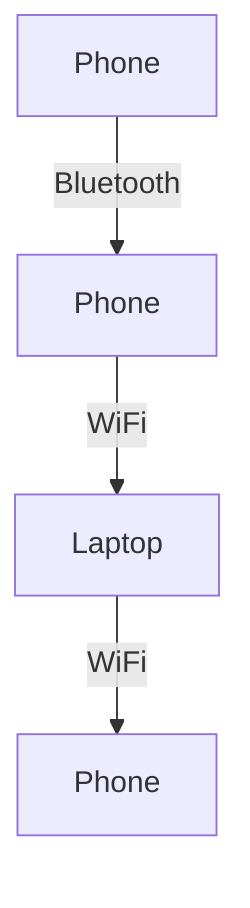
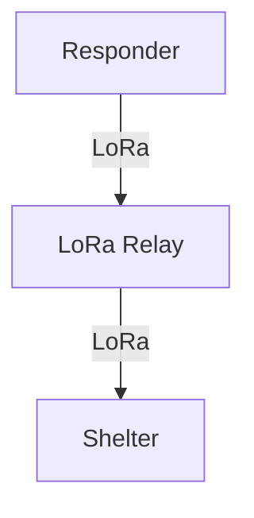
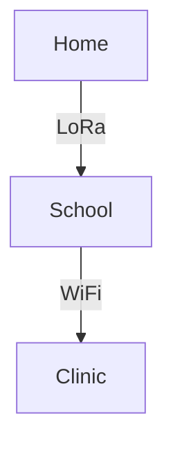
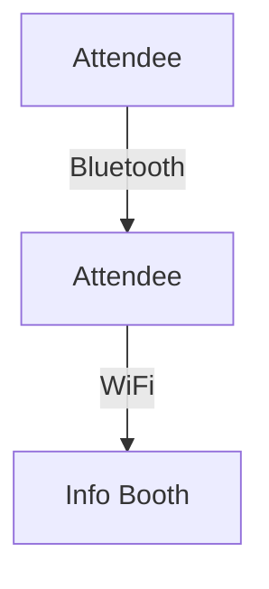
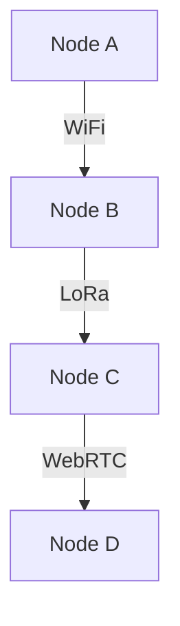

# Case Studies & Real-World Stories

---

## Table of Contents
1. Overview
2. Activist Network in a Censored City
3. Disaster Response in a Blackout
4. Rural Village Connectivity
5. Community Event Mesh
6. Lessons Learned
7. Visuals: Real-World Topologies
8. Best Practices & Takeaways
9. Further Reading & Resources

---

## 1. Overview

This chapter presents real-world deployments of GhostWire, showing how it solves problems for activists, disaster responders, rural communities, and more. Each story includes lessons learned and visuals.

---

## 2. Activist Network in a Censored City
- **Scenario:** Protesters in a city with internet blackouts use GhostWire over Bluetooth and WiFi to coordinate.
- **Deployment:** Dozens of phones and laptops form a mesh, relaying messages across city blocks.
- **Outcome:** Secure, censorship-resistant communication; authorities unable to block or monitor traffic.
- **Visual:**

---

## 3. Disaster Response in a Blackout
- **Scenario:** Hurricane destroys infrastructure; no cell towers or internet.
- **Deployment:** LoRa relays and battery-powered nodes connect first responders and shelters.
- **Outcome:** Reliable messaging and coordination during crisis.
- **Visual:**

---

## 4. Rural Village Connectivity
- **Scenario:** Villages with no internet need to share news and alerts.
- **Deployment:** LoRa radios and WiFi connect homes, schools, and clinics.
- **Outcome:** Community stays informed and connected.
- **Visual:**

---

## 5. Community Event Mesh
- **Scenario:** Large festival with overloaded cell networks.
- **Deployment:** Attendees use GhostWire to form a local mesh for updates and safety alerts.
- **Outcome:** Reliable communication despite network congestion.
- **Visual:**

---

## 6. Lessons Learned
- **Resilience:** Mesh networks keep working when infrastructure fails.
- **Privacy:** End-to-end encryption protects users in hostile environments.
- **Flexibility:** Multiple transports and adapters enable diverse deployments.
- **Community:** Local knowledge and training are key to success.

---

## 7. Visuals: Real-World Topologies

---

## 8. Best Practices & Takeaways
- Train users before deployment.
- Test mesh in real-world conditions.
- Use multiple transports for coverage.
- Document lessons and share with the community.

---

## 9. Further Reading & Resources
- [Mesh Networking 101](https://en.wikipedia.org/wiki/Mesh_networking)
- [GhostWire Developer Guide](12_developer_guide.pdf)

---

## End of Chapter 