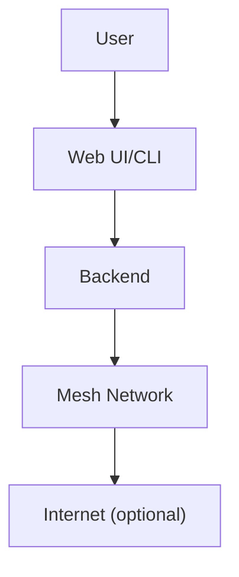

# Glossary & Reference

---

## Table of Contents
1. Glossary
2. Acronyms & Definitions
3. Quick Reference: Commands & Config
4. Troubleshooting Table
5. Visuals: Reference Flows
6. Cross-References
7. Further Reading & Resources

---

## 1. Glossary

| Term/Acronym | Meaning |
|--------------|---------|
| Mesh Network | A network where each device (node) relays data for others, creating a resilient web of connections. |
| Transport    | The method or technology used to send messages (Bluetooth, WiFi, LoRa, etc.). |
| Protocol Adapter | Software that bridges GhostWire to other networks (Briar, Matrix, etc.). |
| Node         | Any device running GhostWire (phone, laptop, server, etc.). |
| Store & Forward | Technique where messages are cached and relayed when possible. |
| Sybil Attack | Attack where one entity pretends to be many nodes. |
| Quota        | Limit on messages or actions to prevent abuse. |
| Federation   | Connecting multiple meshes for wider reach. |
| Blacklist    | List of nodes blocked from the mesh. |
| QuotaEnforcer| Module that limits message rates. |
| KeyManager   | Module that manages encryption keys. |

---

## 2. Acronyms & Definitions
- **E2EE:** End-to-End Encryption
- **UI:** User Interface
- **CLI:** Command-Line Interface
- **API:** Application Programming Interface
- **DoS:** Denial of Service
- **PoW:** Proof of Work
- **PoS:** Proof of Stake
- **LoRa:** Long Range (radio technology)
- **P2P:** Peer-to-Peer

---

## 3. Quick Reference: Commands & Config

### CLI Commands
```sh
ghostwire-cli start --transport wifi --mesh mymesh
ghostwire-cli send --to bob --message "Hello, Bob!"
ghostwire-cli nodes
```

### Config Example
```toml
[transports]
bluetooth = true
wifi = true
lora = false
webrtc = true
tcpip = true
stealth_tcp = false
```

---

## 4. Troubleshooting Table
| Problem                        | Solution                                      |
|-------------------------------|-----------------------------------------------|
| Can’t find other nodes         | Check transport settings, try another method  |
| Messages not sending           | Ensure at least one transport is active       |
| Web UI won’t load              | Check backend is running, try npm install     |
| LoRa not working               | Check hardware, drivers, and permissions      |
| Security warning               | Ensure you’re using the latest version        |

---

## 5. Visuals: Reference Flows


---

## 6. Cross-References
- [Getting Started](02_getting_started.pdf)
- [Architecture Deep Dive](03_architecture.pdf)
- [Transports & Protocols](04_transports.pdf)
- [Security & Privacy](05_security.pdf)
- [Developer Guide](12_developer_guide.pdf)

---

## 7. Further Reading & Resources
- [GhostWire GitHub](https://github.com/phantomojo/GhostWire-secure-mesh-communication)
- [Mesh Networking 101](https://en.wikipedia.org/wiki/Mesh_networking)

---

## End of Chapter 