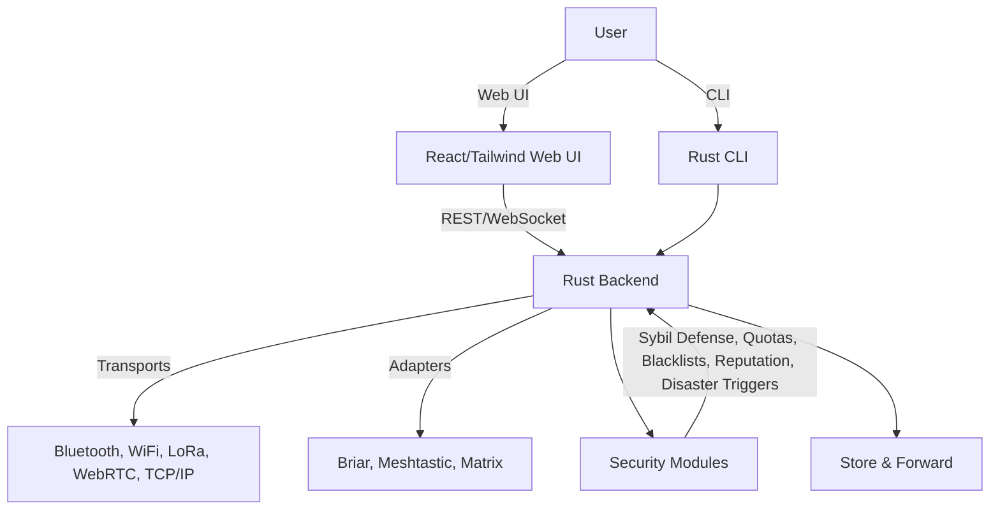

# Architecture Overview

GhostWire is designed for modularity, security, and extensibility. Here’s a high-level look at the system:

---

## System Diagram

---

## Modules

- **Web UI:** Modern React/Tailwind frontend, real-time messaging, network visualization, settings.
- **CLI:** Full-featured command-line interface for node management, messaging, and diagnostics.
- **Backend:** Rust core, async, modular, exposes REST/WebSocket APIs.
- **Transports:** Pluggable modules for Bluetooth, WiFi, LoRa, WebRTC, TCP/IP.
- **Protocol Adapters:** Bridges to Briar, Meshtastic, Matrix, and more.
- **Security Modules:** End-to-end encryption, Sybil defense, quotas, blacklists, disaster triggers, reputation, federation, traffic obfuscation.
- **Store & Forward:** Offline message delivery, caching, and relay.

---

## Design Philosophy
- **Security First:** All code is reviewed for vulnerabilities and privacy risks.
- **Modularity:** New features are added as independent modules/crates.
- **Interoperability:** Prioritize compatibility with other mesh chat protocols.
- **Documentation:** All features and APIs are documented and kept up to date.
- **Community:** Encourage contributions, feedback, and open discussion. 